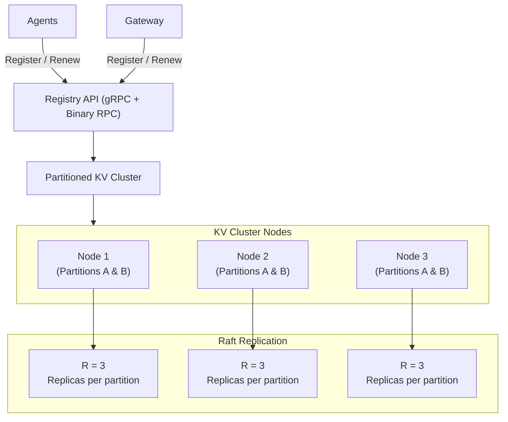
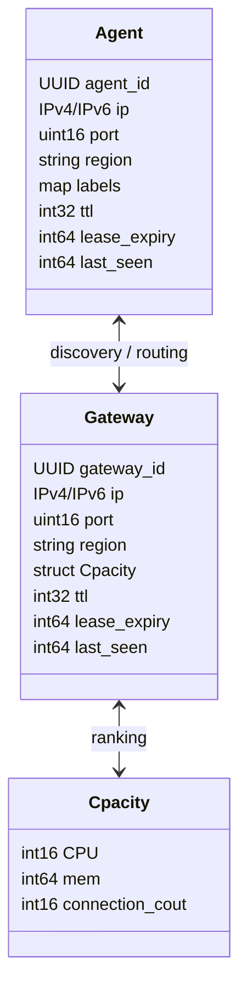

# AgniStack Registry Service Technical Planning Document

## Objective

Design and implement a highly available, ultra-low-latency registry service responsible for maintaining real-time state and connection metadata of all agents and gateways in the AgniStack ecosystem.
This service will act as the single source of truth for component discovery and routing decisions, enabling proxies and controllers to resolve live endpoint details with minimal latency and maximal consistency.

**System Defination**
- **Read-dominant**: 95–99% of operations are reads.
- **Write-minimal**: Writes limited to registration, renewal, and state updates.
- **Horizontally scalable**: Adding nodes increases read throughput linearly.
- **Highly available**: Operates with no single point of failure.
- **Predictably low-latency**: p50 read < 200µs, p99 read < 2ms in local DC.

## Background and Current Limitations
Current implementation uses Redis directly accessed by gateways and agents
- Agents and gateways push connection data directly to Redis.
- Proxy layer fetches connection data from Redis at runtime.

Problem with this model

1. Direct connection model is unscalable every agent/gateway holds a live Redis client.
2. Redis introduces single-threaded bottlenecks under heavy read load.
3. Redis cluster replication increases latency; linearizability guarantees are weak.
4. No control each component writes arbitrarily; consistency is weak.
5. Memory caching within components breaks consistency guarantees and complicates scaling

Hence, Redis is not suitable as the long-term backbone of AgniStack’s registry layer.

## Design Overview

The **Central Registry Service (CRS)** will replace direct Redis interactions with a purpose-built distributed in-memory metadata store that exposes a clean, low-latency gRPC interface for reads and writes.

### **Core Properties**

| 🏷️ **Property** | 🎯 **Target** |
| :---------------------------- | :-------------------------------------- |
| ⏱️ **Latency (p50 read)** | < **5 ms** |
| ⏱️ **Latency (p99 read)** | < **12 ms** |
| ✍️ **Write latency** | < **50 ms** |
| 🔁 **Read availability** | **99.99%** |
| 📦 **Replication factor** | **3** |
| ⚖️ **Consistency** | **Strong** *(leader lease reads)* |
| 🕒 **Staleness (if configured)** | ≤ **100 ms** *(optional stale reads)* |

## High-Level Architecture

### **Components**

1. **Registry API Layer** — Stateless gRPC front-end responsible for routing requests to partition leaders.  
2. **Partition Nodes** — Each node stores one or more partitions in-memory, handling both reads and writes.  
3. **Replication & Consensus** — Each partition is replicated across `R` nodes via Raft consensus groups.  
4. **Proxy Clients** — AgniStack proxies query the registry via local partition routing (no direct Redis).  

## Data Model

### Binanry Layout
All records will be serialized as compact binary structs (FlatBuffers or Cap’n Proto) with fixed-size fields to enable zero-copy deserialization. Average record size needs to be : ≤ 200 bytes

## Core APIs

| API                              | Method | Description                     |
| -------------------------------- | ------ | ------------------------------- |
| `RegisterAgent(AgentRecord)`     | Write  | Creates or renews agent entry   |
| `RegisterGateway(GatewayRecord)` | Write  | Creates or renews gateway entry |
| `GetAgent(agent_id)`             | Read   | Retrieves agent details         |
| `GetGateway(gateway_id)`         | Read   | Retrieves gateway details       |
| `ListAgentsByRegion(region)`     | Read   | Returns all agents in region    |
| `ListGatewaysByRegion(region)`   | Read   | Returns all gateways in region  |

### **Communication Protocol**

* **Transport:** gRPC over QUIC for lower latency and built-in multiplexing.  
* **Serialization:** FlatBuffers or Cap’n Proto (protobuf if FlatBuffers unavailable).  
* **Security:** mTLS with token-bound identity (agents/gateways must authenticate).  

## Storage Layer Design

### Partitioning

* Keyspace partitioned using **consistent hashing** with **virtual nodes (vNodes)**.  
* Total partitions (`P`) ≈ 1024–8192.  
* Each partition assigned to one leader and `R-1` followers (replicas).  

### Replication and Consensus

* Each partition forms a **Raft group** with 3 replicas.  
* Writes are proposed to the partition leader; committed upon majority confirmation.  
* Followers maintain a write-ahead log (WAL) and apply entries to the in-memory map.  

### Read Path

* Reads are served directly from the leader’s in-memory map.  
* Leader uses **time-bounded lease** to serve reads without quorum checks.  
* Stale reads (optional) can be served by followers if replica lag ≤ staleness bound.  

### Write Path

* Writers (agents/gateways) register or renew via leader node.  
* Leader appends update to WAL and replicates via Raft.  
* After quorum commit, state is applied and lease TTL refreshed.  

### Persistence

* WAL and snapshots persisted to local NVMe for crash recovery.  
* Snapshots generated periodically or on partition movement.  
* Log compaction removes expired leases. 

### Rebalancing process

* Assign partitions to new node.  
* Stream snapshot from existing leader.  
* Add node to Raft group as follower.  
* Catch up logs and elect new leader if needed.  
* Update ring map across proxies.

## **12. Security**

* All nodes communicate over **mutual TLS** with x.509 identity.  
* Agents/gateways authenticate via short-lived tokens signed by AgniStack control plane.  
* ACL enforcement:  
  * Agents can only modify their own records.  
  * Gateways can only update their own metadata.  
  * Admin operations (rebalance, partition reassignment) require controller privileges.